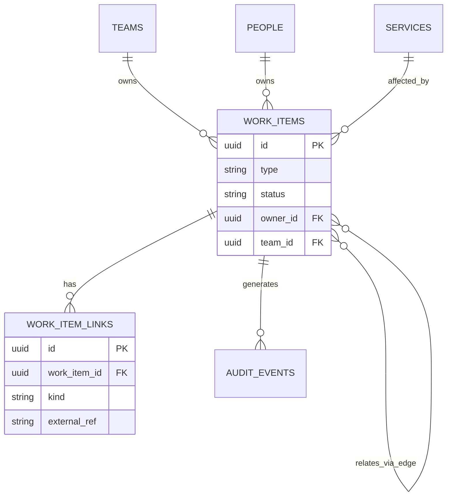
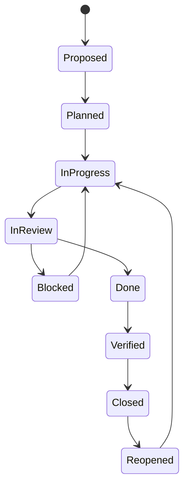

# Unified SDLC & ITSM Platform — Technical Specification

2026-09-18 · Prepared for @Someone

## 1. Executive summary

This specification defines a unified SDLC and ITSM platform that replaces the split between product delivery tools (Jira-class) and IT service management tools (ServiceNow-class) with one canonical work model, one state engine, and one traceability graph spanning idea to production support.

**Problem.** Today a feature's history is scattered: an idea lives in a product tool, its stories in a tracker, its code in git, its deployment in a CI/CD system, and any resulting incident in a separate ITSM tool. No system holds the full chain, so nobody can answer "which incidents trace back to this feature" or "where is work silently aging" without manual cross-referencing.

**Target outcomes.**

- Reduced cycle time (idea to production) and reduced MTTR (incident to resolution), driven by automatic surfacing of items aging past their expected time-in-state.
- End-to-end, queryable traceability: idea → epic → story → commit → deployment → incident → problem → follow-up work.
- One governance model for delivery and operational SLAs, instead of two disconnected policy systems.
- A single pane of glass for status across product and ops leadership.

**Approach.** A canonical `WorkItem` entity used by every item type (idea, story, incident, change, release, etc.), a configurable but shared state-machine and aging/SLA engine, an event-sourced core for audit and analytics, and an integration layer that connects to (rather than immediately replaces) existing git, CI/CD, monitoring, and CMDB tooling.

## 2. Scope, principles and non-goals

**In scope (v1 platform capability, not necessarily v1 delivery — see roadmap).** Idea intake and backlog; epics, features, stories, tasks, bugs; release and change management; incident and problem management; cross-lifecycle traceability; aging and SLA governance; dashboards and reporting; integrations to git, CI/CD, monitoring, CMDB, chatops, and identity.

**Non-goals.** The platform does not aim to replace a full enterprise CMDB, become an APM/observability tool, become a source-code host, or become a general-purpose wiki. It integrates with those systems rather than reimplementing them.

**Guiding principles.**

- **One canonical model, many item types.** Every unit of work — idea, story, incident, change — is a typed `WorkItem`, not a bespoke schema per domain.
- **Event-sourced core.** State changes are immutable events, not overwritten fields; this gives audit trail and analytics for free.
- **Configuration over code.** Workflow, SLA thresholds, and escalation policy are data, so operations and product teams can tune their own lifecycles without a redeploy.
- **API-first, integration-friendly.** Every capability is available via API before it is available via UI; existing tools connect in as adapters during transition.
- **Least-privilege, audit-first security.** Every transition and every read of sensitive data is attributable to an actor.

## 3. Domain & data model

### 3.1 Canonical WorkItem

Every idea, epic, feature, story, task, bug, incident, problem, change request, and release is one row in a single `work_items` table, differentiated by `type`.

| Field | Type | Notes |
| --- | --- | --- |
| id | UUID | Primary key |
| type | enum | idea, epic, feature, story, task, bug, incident, problem, change, release, test\_case |
| title | string |  |
| description | text |  |
| status | string | Current state; see §4 for per-type state machines |
| priority | enum | P0–P4 |
| severity | enum, nullable | Incidents/problems only: SEV1–SEV4 |
| owner\_id | UUID | FK → people |
| team\_id | UUID | FK → teams |
| org\_id | UUID | Tenant/business-unit scope |
| created\_at / updated\_at | timestamp |  |
| entered\_state\_at | timestamp | Start of current state, drives aging |
| due\_date | timestamp, nullable |  |
| custom\_fields | JSONB | Per-type extensible fields (e.g. story points, RCA summary) |
| tags | string\[\] |  |

### 3.2 Relationships (graph edges)

Relationships are first-class, typed edges, not foreign keys buried in one direction:

| Edge type | Example | Cardinality |
| --- | --- | --- |
| parent\_of / child\_of | Epic → Story | 1:N |
| blocks / blocked\_by | Story blocks Story | N:N |
| relates\_to | General association | N:N |
| caused\_by | Incident caused\_by Problem | N:1 |
| fixed\_by | Bug fixed\_by commit/PR | N:N |
| deployed\_in | Story deployed\_in Release | N:N |
| affects | Incident affects Service | N:N |
| duplicate\_of | Incident duplicate\_of Incident | N:1 |

### 3.3 Supporting entities

- **Team** — owns work items; has an on-call rotation and SLA calendar.
- **Person** — org member; roles resolved via RBAC (§12).
- **Service/Asset** — lightweight internal CMDB entry (name, owner team, environment); federates with an external CMDB where one exists (§9).
- **Link** — external reference (commit SHA, PR URL, pipeline run ID, alert ID) attached to a WorkItem.
- **Comment**, **Attachment** — standard collaboration objects.
- **AuditEvent** — immutable record of every mutation (§8, §12).

### 3.4 Org model

`Organization → Business Unit → Team → Person`, with every WorkItem scoped to a `team_id` and `org_id` for multi-tenant isolation.

### 3.5 Entity relationship diagram



## 4. State machine & workflow engine

One workflow engine serves every item type. Each type has its own `WorkflowDefinition` (allowed states, allowed transitions, guards, entry/exit actions), but the engine that enforces transitions, computes time-in-state, and fires events is shared code.

### 4.1 Generic lifecycle



Delivery item types (idea, epic, story, task, bug) map onto this generic lifecycle directly. Operational item types layer service-specific states on top:

| Type | Additional/renamed states |
| --- | --- |
| Incident | Triaged → Investigating → Mitigated → Resolved → Post-incident review → Closed |
| Problem | Identified → Root cause analysis → Fix planned → Fix in progress → Verified → Closed |
| Change request | Submitted → CAB review → Approved/Rejected → Scheduled → Implemented → Closed |
| Release | Planned → Building → Staged → Deployed → Monitoring → Closed |

### 4.2 WorkflowDefinition (config shape)

```json
{
  "type": "incident",
  "states": ["triaged", "investigating", "mitigated", "resolved", "post_incident_review", "closed"],
  "transitions": [
    {"from": "triaged", "to": "investigating", "guard": "actor.role in [on_call, incident_commander]"},
    {"from": "investigating", "to": "mitigated", "requires_fields": ["mitigation_summary"]}
  ],
  "sla": {"investigating": {"threshold_minutes": 60, "calendar": "24x7"}}
}
```

### 4.3 Engine responsibilities

- Validate every transition against the type's `WorkflowDefinition` (allowed edge, RBAC guard, required fields).
- On transition: close out `entered_state_at`, emit `WorkItemStateChanged`, recompute aging clocks (§6).
- Support automatic transitions driven by integration events — e.g. a merged pull request auto-transitions a linked Story from `InProgress` to `InReview`; a resolved monitoring alert auto-transitions an Incident to `Mitigated` pending human confirmation.
- Version workflow definitions so in-flight items are unaffected by a policy change mid-lifecycle.

## 5. Traceability graph

The graph service treats every `WorkItem` as a node and every relationship in §3.2 as a typed, directed edge, and exposes traversal as a first-class query rather than a manual link-following exercise.

### 5.1 Query patterns

| Query | Direction | Example use |
| --- | --- | --- |
| Upstream trace | child → ancestors | Which idea and epic produced this incident's root-cause fix? |
| Downstream trace | parent → descendants | Which production incidents trace back to this feature? |
| Impact analysis | incident → affected | Which stories/releases/services does this incident touch? |
| Lineage report | full path | Full idea-to-closure chain, for audit or postmortem |

### 5.2 API shape

```
GET /workitems/{id}/lineage?direction=up|down&depth=N&edge_types=parent_of,fixed_by,deployed_in
```

### 5.3 Storage choice

| Option | When to use |
| --- | --- |
| Property graph DB (Neo4j, Amazon Neptune) | v2+, once traversal depth/volume make recursive SQL slow (deep chains, cross-team impact analysis at scale) |
| Edge table + recursive CTE on the relational store | MVP — same data model, avoids operating a second database class before it's needed |

Recommendation: start with the edge-table approach on the primary relational store (§11) and migrate the traversal-heavy read path to a graph DB once query patterns and volume justify it — the `WorkItem`/edge model does not change, only where it is queried from.

## 6. Aging & SLA engine

This is the engine that delivers the core ask: flag items sitting in a state longer than they should.

### 6.1 SLA policy

Each `(item type, state)` pair has a configurable threshold and business calendar:

| Type | State | Threshold | Calendar |
| --- | --- | --- | --- |
| Story | In Review | 2 business days | 5x8 |
| Bug (P1) | In Progress | 1 business day | 5x8 |
| Incident (SEV1) | Investigating | 60 minutes | 24x7 |
| Change request | CAB review | 3 business days | 5x8 |

### 6.2 Aging computation

- On every state entry, the engine stamps `entered_state_at` and schedules an aging check.
- Aging is recomputed continuously (not just on transition) via a lightweight scheduled recalculation (e.g. every 60 seconds) against the business calendar, producing a normalized `aging_score` (0–100%+ of threshold consumed).
- Buckets for the aging heatmap: green (<75% of SLA), amber (75–100%), red (>100%, breached).

### 6.3 Escalation policy

| Trigger | Action |
| --- | --- |
| 75% of SLA consumed | Warning notification to item owner |
| 100% of SLA consumed | `SLABreached` event; notify owner + team lead |
| 150% of SLA consumed | Escalate to manager/on-call; surface on executive aging dashboard |

Escalation policy, like workflow, is configuration per type/team, not hard-coded — a platform team can tune thresholds without a deployment.

## 7. System architecture

Microservices around bounded contexts, communicating primarily through the event bus (§8), with synchronous REST/GraphQL for read paths. The core follows CQRS: an event-sourced write model plus materialized read views for dashboards and reporting.

| Service | Responsibility | Primary store | Sync/async |
| --- | --- | --- | --- |
| Work Item Service | CRUD on canonical WorkItem, emits domain events | Postgres | Sync write, async publish |
| Workflow Engine | Validates transitions, enforces WorkflowDefinition | Postgres (definitions) | Sync |
| Aging & SLA Engine | Computes time-in-state, fires warnings/breaches | Redis (clocks) + Postgres | Async, scheduled |
| Traceability Graph Service | Edge storage, lineage queries | Postgres (MVP) → graph DB (v2) | Sync read |
| Integration Gateway | Normalizes inbound webhooks from git/CI/monitoring/CMDB | Stateless | Async |
| Notification Service | Routes warnings/breaches/mentions to email/Slack/Teams | Redis queue | Async |
| Analytics/Reporting Service | Flow metrics, DORA/ITIL KPIs, materialized views | OLAP store (e.g. ClickHouse) | Async, batch + streaming |
| Identity/Access Service | AuthN/AuthZ, RBAC, SSO/SCIM | Postgres | Sync |
| Audit/Event Log Service | Immutable event store, compliance export | Event log (Kafka + cold storage) | Async |
| API Gateway | Single entry point, rate limiting, auth enforcement | — | Sync |

Each service owns its data; cross-service reads go through APIs or materialized views, never direct database access — this is what keeps the workflow engine, aging engine, and integrations independently deployable.

## 8. Event model & event bus

### 8.1 Event catalog (representative)

| Event | Emitted by | Consumed by |
| --- | --- | --- |
| WorkItemCreated | Work Item Service | Analytics, Notification |
| WorkItemStateChanged | Workflow Engine | Aging Engine, Analytics, Traceability |
| LinkCreated / LinkRemoved | Work Item Service | Traceability, Analytics |
| SLAWarning / SLABreached | Aging & SLA Engine | Notification, Analytics |
| CommentAdded | Work Item Service | Notification |
| GitCommitLinked / DeploymentCompleted | Integration Gateway | Work Item Service, Workflow Engine |
| AlertFired / AlertResolved | Integration Gateway | Work Item Service (auto-creates/updates Incident) |

### 8.2 Envelope schema

```json
{
  "event_id": "uuid",
  "event_type": "WorkItemStateChanged",
  "schema_version": 1,
  "timestamp": "2026-09-18T10:15:00Z",
  "actor": {"type": "user|system|integration", "id": "uuid"},
  "work_item_id": "uuid",
  "payload": {"from_state": "in_progress", "to_state": "in_review"}
}
```

Schemas are registered (Avro/JSON Schema) and versioned; consumers must tolerate additive changes.

### 8.3 Transport

- Kafka (or a managed equivalent — AWS MSK/EventBridge, Azure Event Hubs, Confluent Cloud) as the backbone.
- Partition key: `work_item_id` (or `tenant_id` for tenant-wide streams) to guarantee per-item ordering.
- At-least-once delivery; consumers are idempotent, deduping on `event_id`.
- Dead-letter queue per consumer group for events that fail processing after retry, with alerting on DLQ depth.

## 9. Integration architecture

All external systems connect through the Integration Gateway, which normalizes vendor-specific payloads into the platform's own event schema (§8) — no downstream service parses vendor formats directly.

| Integration | Direction | Protocol | Data synced |
| --- | --- | --- | --- |
| Git (GitHub/GitLab/Bitbucket) | Inbound | Webhooks | Commits, PRs, branches → linked to WorkItems via commit message references |
| CI/CD (Jenkins/GH Actions/CircleCI) | Inbound | Webhooks | Pipeline runs, deployments → linked to Story/Release, can auto-transition state |
| Monitoring/APM (Datadog, Prometheus, PagerDuty) | Inbound | Webhooks/polling | Alerts fired/resolved → auto-create or update Incident WorkItems |
| CMDB (existing ServiceNow CMDB, or internal) | Bidirectional | REST/API sync | Service/Asset registry; either federated (read from source of truth) or mirrored |
| ChatOps (Slack/Teams) | Bidirectional | Bot + webhooks | Status queries, incident commands, approvals |
| Identity (Okta/Azure AD) | Inbound | SAML/OIDC + SCIM | SSO login, user/team provisioning |

**System-of-record decision.** For each integration, decide explicitly whether the external tool remains authoritative for its own data (platform stores a reference/link only) or whether the platform becomes the system of record post-migration. Recommendation for v1: git, CI/CD, and monitoring tools stay authoritative (platform stores links + status); the platform becomes authoritative for work-item state and traceability from day one, since that is the capability gap it exists to close.

## 10. API design

**API-first.** Every workflow, aging, and traceability capability described above is available via API before it appears in any UI.

- **GraphQL** for flexible, cross-entity read queries — dashboards, traceability explorer, ad hoc reporting.
- **REST** for straightforward CRUD, transitions, and integration webhooks (simpler for external systems to call).
- **Auth:** OAuth2 client-credentials for service-to-service and integrations; user-scoped JWT (issued after SSO) for interactive clients.

### 10.1 Key resources

| Resource | Purpose |
| --- | --- |
| `POST /workitems` | Create a work item of any type |
| `POST /workitems/{id}/transitions` | Attempt a state transition (validated by Workflow Engine) |
| `POST /workitems/{id}/links` | Create a typed edge to another item or external ref |
| `GET /workitems/{id}/lineage` | Traceability query (§5.2) |
| `GET /workitems?state=in_review&aging_bucket=red` | Aging/filter queries for dashboards |
| `POST /webhooks/{integration}` | Inbound integration events |
| `GET /reports/flow-metrics` | Cycle time, lead time, throughput |

### 10.2 Example: attempting a transition

```
POST /workitems/INC-4821/transitions
{ "to_state": "mitigated", "fields": { "mitigation_summary": "Rolled back v2.3.1" } }

409 Conflict
{ "error": "guard_failed", "reason": "actor lacks role 'incident_commander'" }
```

Rejecting invalid transitions with a structured, actionable error (rather than a generic 400) is deliberate — it's what lets a chatops bot or a UI surface the real reason to the user.

## 11. Infrastructure & deployment architecture

Cloud-agnostic reference stack (mappable to AWS/Azure/GCP equivalents):

| Layer | Choice | Notes |
| --- | --- | --- |
| Compute | Kubernetes (EKS/AKS/GKE) | Stateless services, autoscaled via HPA |
| Primary datastore | Managed Postgres | WorkItem, edges (MVP), workflow definitions |
| Event bus | Managed Kafka (MSK/Confluent Cloud/Event Hubs) | Partitioned by work\_item\_id/tenant\_id |
| Graph store (v2+) | Neptune / Neo4j Aura | Traceability at scale, once justified (§5.3) |
| Search | OpenSearch/Elasticsearch | Full-text search across work items |
| Cache/clocks | Redis | Aging-engine clocks, session cache |
| OLAP/reporting | ClickHouse or equivalent | Flow metrics, DORA/ITIL dashboards |
| Object storage | S3-compatible | Attachments, cold audit export |

**Environments.** dev → staging → prod, each an isolated namespace/cluster; infrastructure as code via Terraform; deployment via GitOps (ArgoCD/Flux) so environment state is itself version-controlled and auditable — fitting, for a platform whose whole premise is traceability.

**Scaling.** Stateless services scale horizontally; Kafka partitioning isolates noisy tenants; read replicas serve the reporting/analytics path so heavy queries never contend with transactional writes.

**Disaster recovery.**

| Target | Value |
| --- | --- |
| RPO (data loss tolerance) | ≤ 5 minutes (event log + streaming replication) |
| RTO (recovery time) | ≤ 1 hour for full-region failover |
| Backup | Multi-AZ synchronous replication; cross-region backup, daily |

## 12. Security, compliance & audit

**RBAC model.** `Role → Permission set`, scoped by team/project/org. Permissions gate not just reads/writes but individual workflow transitions — e.g. only an on-call engineer or incident commander role can transition an Incident to `Resolved`; only a CAB-approver role can approve a Change request.

**Data protection.** Encryption at rest (datastore-native) and in transit (TLS 1.2+ everywhere); PII fields (if any, e.g. reporter contact info) classified and access-logged separately from general work-item data.

**Compliance alignment.** Architecture is built to support SOC 2 and ISO 27001 controls, and ITIL-aligned change/incident processes, without being certified out of the box:

- Immutable audit trail — a direct consequence of the event-sourced core (§8); every state change carries an actor, timestamp, and reason.
- Configurable data retention per record type (e.g. audit events retained 7 years, comments per org policy).
- Audit export: `GET /audit/export?work_item_id=…` for compliance reviews and postmortems.

**Audit reporting.** Every question of "who changed what, when, and from which state to which" is answerable directly from the event log — no reconstruction from application logs or database diffs.

## 13. Non-functional requirements

| Category | Target |
| --- | --- |
| Availability | 99.9% for core Work Item/Workflow services |
| API latency | p95 < 300ms for reads, < 500ms for writes |
| Integration ingestion latency | Webhook received → normalized event published in < 5s |
| Aging recompute latency | Aging scores refreshed at least every 60s |
| Dashboard refresh | < 30s from underlying event to visible update |
| Scale (initial target) | 1M+ work items, 10K events/sec peak, 10K+ concurrent users |
| Multi-tenancy | Full data isolation per `org_id`; no cross-tenant query path |

## 14. Analytics & reporting

| Category | Metrics |
| --- | --- |
| Flow metrics | Cycle time, lead time, throughput, work-in-progress, aging distribution by state |
| DORA (delivery) | Deployment frequency, change failure rate, MTTR, lead time for changes |
| ITIL/ITSM | MTTA, MTTR, incident backlog size, SLA compliance %, problem recurrence rate |
| Traceability | Idea-to-production lead time, % of incidents with a traced root feature |

**Dashboards.**

- **Team view** — aging heatmap (§6.2) and board for the team's own work items.
- **Executive view** — cross-team flow and SLA compliance, rolled up by business unit.
- **Traceability explorer** — interactive graph view for tracing a single item's full lineage.

All dashboards read from the Analytics Service's materialized views (§7), never directly from the transactional write model, so reporting load never contends with the workflow engine.

## 15. MVP scope & phased roadmap

| Phase | Focus | Key deliverables |
| --- | --- | --- |
| 0 — Foundation | Core data model | Canonical WorkItem service, single shared state machine, two item types live (Story, Incident), manual linking, basic RBAC |
| 1 — Signal | Aging & first integrations | Aging/SLA engine, team + executive dashboards, git and CI/CD integration, auto-transitions from pipeline events |
| 2 — Traceability | Full lineage | Traceability graph service and API, monitoring/APM integration (auto-incident creation), notification/escalation service |
| 3 — Scale & governance | Enterprise hardening | CMDB federation, chatops, DORA/ITIL analytics suite, multi-tenant hardening, graph DB migration if warranted by volume |

Each phase is independently shippable and demonstrable: Phase 0 alone already proves the canonical-model thesis on two item types before any integration work begins.

## 16. Open questions, risks & assumptions

**Open questions.**

- [ ] Build vs. buy for the graph store, and at what item/edge volume does it become necessary?
- [ ] Single-tenant deployments per business unit, or one multi-tenant SaaS instance?
- [ ] How much of the CMDB should the platform own vs. federate from an existing ServiceNow CMDB?
- [ ] Is formal change management (CAB approvals) in scope for v1, or deferred to Phase 3?

**Risks.**

- Adoption resistance — teams entrenched in Jira/ServiceNow may resist a data-model migration; mitigate with the integration-first approach (§9) so existing tools keep working during transition.
- Integration complexity — legacy CMDB and monitoring tools vary widely in webhook/API quality; budget discovery time per integration.
- Operational complexity — running Kafka and (later) a graph database adds operational surface area; ensure platform team has or builds this expertise before Phase 2.
- Skill gap — graph query patterns (Cypher/Gremlin) are less common than SQL; factor training/hiring into the Phase 2/3 timeline.

**Assumptions.**

- Teams are willing to create new work items directly in the platform, even while legacy tools remain integrated read sources during transition.
- Existing git, CI/CD, and monitoring tools remain the system of record for their own domains for the foreseeable future (§9).

## 17. Technology stack

Two stacks are defined: a **pilot stack** optimized for a small team (or coding agents, §19) shipping fast with minimal operational surface, and a **target stack** for scale, introduced only once the pilot has proven the model.

### 17.1 Pilot stack (single runtime, minimal ops)

| Layer | Choice | Rationale |
| --- | --- | --- |
| Core services (Work Item, Workflow, Traceability, RBAC) | TypeScript (NestJS) | One language across the whole pilot; strong typing catches contract mismatches early, which matters more than usual when review bandwidth is limited (§19) |
| Workflow/state machine | Hand-rolled engine per §4, no external orchestrator | Keeps the pilot to one deployable; revisit once SLA timers and long-running approvals (Epic 8+) are in scope |
| AI/agentic capabilities | Anthropic TypeScript SDK, same NestJS service | Avoids a second runtime for the pilot; triage/summarization endpoints called from the same codebase |
| Primary datastore | Postgres with `pgvector` | Transactional data, edges (traceability), and semantic search from one extension — no separate vector DB needed yet |
| Event handling | In-process interface (stubbed bus) | Matches the calling contract of the real event bus (§8) so it can be swapped in without touching business logic |
| Frontend | React + TypeScript (Next.js), tRPC | End-to-end type safety with a TS backend; fastest path to a working UI |
| Auth | WorkOS or Okta (hosted) | SSO/RBAC is a solved problem — not worth building even for a pilot |
| Infra | Single Kubernetes namespace or a PaaS (Render/Fly.io) | Minimal ops burden; Terraform optional at this stage |

### 17.2 Target stack (post-pilot, at scale)

| Layer | Choice | Rationale |
| --- | --- | --- |
| Transactional core | TypeScript (NestJS) or Go | Same as pilot, or migrate hot-path services to Go if latency/throughput demands it |
| Workflow & SLA engine | Temporal.io | Durable execution for guarded transitions, SLA timers, and multi-day approval workflows (§4, §6) without hand-rolled scheduling |
| AI/agentic services | Python (FastAPI), Anthropic SDK, Claude Agent SDK/MCP | Mature ecosystem for embeddings, agent orchestration, and evaluation tooling; isolated as its own service boundary |
| Datastores | Postgres (+pgvector), Redis, OpenSearch, Neo4j/Neptune (traceability at scale, per §5.3) | As specified in §11, plus AI-driven semantic search |
| Event bus | Managed Kafka or cloud-native pub/sub (EventBridge/Pub-Sub/Event Hubs) | Per §8; cloud-native pub/sub trades some portability for materially lower ops burden |
| Frontend | React + TypeScript (Next.js), GraphQL subscriptions | Live dashboard/aging-heatmap updates |
| Multi-tenancy | Pooled Postgres with row-level security on `org_id`; escape hatch to schema-per-tenant or dedicated clusters for enterprise isolation demands | Decide the tenancy model early — retrofitting it later is expensive |
| Observability | OpenTelemetry end to end | Required once a request crosses Work Item Service → workflow engine → aging engine → notifications |
| Infra | Kubernetes (EKS/AKS/GKE), Terraform, ArgoCD (GitOps) | Matches §11 |

### 17.3 AI-driven capabilities (where AI actually plugs in)

| Capability | How |
| --- | --- |
| Incident/bug auto-triage | Claude API classifies severity and suggested owner from alert/report text |
| Postmortem/summary drafting | Claude drafts a summary from an item's full event timeline (§8), human reviews before publishing |
| Natural-language queries over the work graph | "Show me everything blocking the Q3 release" resolved via Claude + traceability API (§5) |
| Similar-incident search | `pgvector` embedding similarity — "has this happened before," directly improving MTTR |
| Chatops (Epic 12) | MCP server exposing the platform's own API so an agent can reason about multi-step chat commands, rather than hand-parsed slash commands |

## 18. PoC / pilot scope

### 18.1 Objective

Prove the platform's core thesis — one canonical work-item model and one state-machine engine serving both a delivery item type and an operational item type, with real, queryable traceability between them — before investing in the event bus, integrations, aging engine, or dashboards. This is Phase 0 of the roadmap (§15), scoped tightly enough to be buildable by coding agents (§19).

### 18.2 In scope

| Epic | Stories included | Notes |
| --- | --- | --- |
| Epic 1 — Canonical work item model | US1.1, US1.2, US1.3 | Story and Incident types only |
| Epic 2 — Workflow & state machine | US2.1, US2.2 | US2.3 (auto-transitions from external events) deferred — no integrations in the pilot |
| Epic 4 — Traceability | US4.1, US4.2 | Manual linking; edge-table on Postgres, no graph database |
| Epic 10 — RBAC | US10.3 only | A minimal role check on transitions; SSO/SCIM (US10.1, US10.2) deferred to a hosted-auth pilot phase |

### 18.3 Explicitly out of scope

Aging/SLA engine (Epic 3), event bus (Epic 5), all external integrations (Epics 6, 7, 11, 12), dashboards/reporting (Epic 9), notifications (Epic 8), SSO/SCIM. Where the target architecture assumes an event bus, the pilot stubs it with an in-process interface matching the real contract (§17.1), so nothing has to be rewritten to extend it later.

### 18.4 Exit criteria

- [ ] A Story and an Incident can each be created and transitioned through their full state machine from §4, with role-gated transitions correctly rejecting unauthorized actors.
- [ ] A typed link can be created between a Story and an Incident, and an upstream/downstream lineage query (US4.2) returns the correct chain.
- [ ] Every acceptance criterion in the four in-scope epics has a passing automated test.
- [ ] A written note on what would need to change to extend into Phase 1 (aging engine, first integration) — this becomes the input to the next scoping pass.

### 18.5 Suggested duration

2–4 weeks with a coding-agent-driven team (§19), given the narrow scope and the detailed acceptance criteria already available in the backlog tab — most of the ambiguity that would slow a from-scratch build has already been resolved in this specification.

## 19. Operating model: building with coding agents instead of human developers

Without a human engineering team, the specification and backlog stop being reference material and become the actual control mechanism — the tighter and more testable the acceptance criteria, the less that has to rely on a human catching a subtle mistake. The practices below are built around that.

### 19.1 Your role shifts from writing code to specifying and reviewing it

You become the architect and reviewer, not the implementer. Concretely, that means:

- Approving the implementation plan before any code is written (as in the Claude Code prompt already given to you) — this is your highest-leverage checkpoint, since it's far cheaper to redirect a plan than a finished implementation.
- Reviewing pull requests against acceptance criteria, not reading every line of code — each user story's AC (backlog tab) should map directly to what you check.
- Making the judgment calls an agent is instructed to flag rather than guess: ambiguous requirements, architectural trade-offs, and anything security- or data-isolation-sensitive.

### 19.2 Story-by-story cadence, not "build the whole thing"

- One user story per agent session/branch, in the order laid out in the pilot scope (§18.2). Small, single-purpose changes are easier for you to review and for the agent itself to reason about correctly.
- Require the agent to write the test for each acceptance criterion before or alongside the implementation — this is the primary safety net in the absence of a human reviewer who would otherwise catch logic errors by inspection.
- Require a short report per story: which AC pass, with test output, before moving to the next story. Don't let an agent self-report "done" without evidence.

### 19.3 Guardrails to put in place before starting

| Guardrail | Why it matters more without human coders |
| --- | --- |
| CI enforcing tests + lint + type-check before merge | This becomes your actual quality gate, not a formality — nothing merges on an agent's say-so alone |
| One story per PR, referencing its user-story ID | Keeps review scoped and traceable back to the backlog doc |
| A second agent (or a second pass by the same agent, prompted specifically as reviewer) reviews every PR before you do | Catches a class of mistakes a single pass tends to miss; you review its findings, not raw code |
| Extra scrutiny on RBAC/auth, multi-tenant isolation, and anything touching the audit trail (§12) | These are the areas where a subtle bug is a security incident, not a bug report — worth a dedicated human look even if everything else is agent-reviewed |
| A staging environment with realistic seed data, plus an easy rollback path | Replaces the safety net a human QA pass or careful senior reviewer would otherwise provide |

### 19.4 Keep the specification and backlog as living documents

When an agent hits something the spec or backlog doesn't cover, the instruction should be to stop and ask, or propose an addition to this document, rather than silently deciding — that keeps this document accurate as the single source of truth for what the system is actually supposed to do, which matters even more when no one is holding the full design in their head.

### 19.5 Parallelism, carefully

Running multiple agent sessions on independent epics (e.g. one on Epic 1, another on Epic 4) can work once both share the same schema and API contracts from this specification, but sequence anything touching the same files or database migrations rather than parallelizing it — merge conflicts and race conditions in schema changes are exactly the kind of error that's hard to catch without a human deeply familiar with the codebase.

## 20. Dogfooding & bootstrap strategy

The platform's core value proposition — traceability from idea to production support — is best validated by using the platform to trace its own build. Since the platform can't be used to build itself before it exists, dogfooding is staged rather than immediate.

### 20.1 Stage A — pre-pilot: track the build in the platform's own shape

Before Phase 0 ships, track the build in whatever lightweight tool is available (GitHub Issues/Projects, or this specification's own backlog tab), but structure every tracked item identically to the canonical WorkItem model:

- Every issue gets a `type` (epic, story, bug) matching §3.1, a `status` matching the shared state machine (§4), and a `parent_of`/`child_of` link to its epic, matching §3.2.
- This is not dogfooding yet, but it means the Stage B migration is a straightforward import rather than a redesign.

### 20.2 Stage B — first real dataset: import the backlog into itself

The first real use of the platform, immediately after the pilot (§18) passes its exit criteria, is importing this specification's own backlog as the first tenant's data:

- Each epic becomes an Epic work item, each user story a Story, linked `parent_of`/`child_of` exactly as modeled in §3.2.
- This doubles as an integration test: can the API ingest a real, non-trivial (12-epic) backlog and preserve its hierarchy correctly, without synthetic seed data standing in for reality.

### 20.3 Stage C — steady state: the platform tracks its own evolution

From Phase 1 onward, every bug, incident, and feature request against the platform itself is filed as a work item inside the platform:

- A bug in the aging engine is filed as a `Bug`, linked `fixed_by` to its fix PR and `caused_by` back to the story that introduced it — the exact traceability chain the spec promises, demonstrated on real data.
- The team's own aging heatmap (§9) surfaces when the team's own tickets are stalling, which is a more credible validation of the aging engine than any synthetic test case.

### 20.4 Guardrail

Keep Stage A lightweight — a spreadsheet or GitHub Projects board with the right fields is enough. Building tooling to track the build should never become its own project that delays Phase 0.
